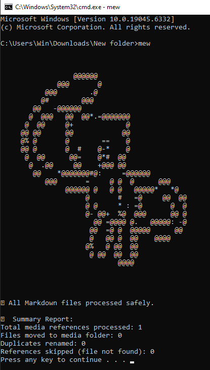

# Markdown-Multimedia-Organizer-CLI-Tool-

This tool automatically **organizes and renames media files** (images, audio, video) referenced in your Markdown (`.md`) files.
It moves all linked media into a centralized `media/` folder, **renaming them intelligently** based on their captions or titles, and updates all references in the Markdown or HTML tags accordingly.

Perfect for keeping your Markdown projects tidy, portable, and ready for publishing or version control.



---

## 🚀 Features

✅ **Moves media files** into a consistent `/media` directory.
✍️ **Renames files** using their alt text (`![Alt Text]`) or HTML title attribute (`title="..."`).
🧠 **Updates Markdown and HTML tags** automatically with new filenames and paths.
🔁 **Handles duplicates** safely (e.g., `image_1.png`, `image_2.png`).
🧹 **Cleans up filenames** by removing spaces and special characters.
📄 **Processes all `.md` files** in the current folder.
📊 **Prints a clean summary report** of all actions taken.

---

## 🧰 Example

### Before running `mew`

```
project/
├── post1.md
├── img123.png
├── audio_clip.mp3
└── video_final.mp4
```

Contents of `post1.md`:

```md


<audio src="audio_clip.mp3" title="Intro Audio"></audio>
<video src="video_final.mp4" title="Demo Clip"></video>
```

---

### After running `mew`

```
project/
├── mew.py
├── mew.bat
├── post1.md
└── media/
    ├── Logo_Image.png
    ├── Intro_Audio.mp3
    └── Demo_Clip.mp4
```

Contents of `post1.md` (auto-updated):

```md


<audio src="media/Intro_Audio.mp3" title="Intro Audio"></audio>
<video src="media/Demo_Clip.mp4" title="Demo Clip"></video>
```

---

## ⚙️ Installation

1. Ensure **Python 3.8+** is installed:

   ```bash
   python --version
   ```

2. Place these two files in the same directory:

   ```
   mew.py
   mew.bat   (or mm.bat)
   ```

3. *(Optional)* Add the folder to your **Windows PATH** if you want to run it globally:

   * Search “Environment Variables” → open “Edit the system environment variables”.
   * Under *User variables*, edit **Path** and add the folder path.
   * Restart the terminal or File Explorer.

---

## 🏃 Usage

You can use the tool in **two ways**:

### **Option 1 – From the Command Line**

Navigate to any folder containing Markdown files, then run:

```bash
mew
```

or

```bash
mm
```

The tool will:

* Process all `.md` files in the current folder.
* Move and rename media files into a new `/media` folder.
* Update all references automatically.

---

### **Option 2 – From Windows Explorer Search Bar**

From inside any folder containing Markdown files:

1. Click on the address/search bar.
2. Type:

   ```
   mew
   ```

   or

   ```
   mm
   ```
3. Press **Enter** — the tool will execute for that folder.

This works because the `.bat` file uses the current working directory context.

---

## 🧩 Renaming Logic

When processing each media reference:

* For Markdown images:
  The new file name is derived from the **alt text** in the `` syntax.
  Example:

  ```md
  
  ```

  becomes → `media/Profile_Photo.png`.

* For HTML audio/video tags:
  The new file name is derived from the **title** attribute, if available:

  ```html
  <audio src="intro.mp3" title="Welcome Message"></audio>
  ```

  becomes → `media/Welcome_Message.mp3`.

* If no alt text or title is provided, the tool uses the **prefix** (`image`, `audio`, `video`) as a fallback name.

---

## 📊 Example Output

```
✅ All Markdown files processed safely.

📊 Summary Report:
Total media references processed: 14
Files moved to media folder: 10
Duplicates renamed: 2
References skipped (file not found): 2
```

---

## ⚠️ Notes

* The tool **only processes the current directory** — it doesn’t scan subfolders.
* Skipped files (missing paths) are safely ignored and reported.
* You can rename `mew.bat` to any shortcut (e.g., `mm.bat`, `organize.bat`).
* If you re-run the tool, it will detect already-moved files and skip them unless duplicates occur.

---
